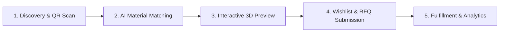

<div align="center">

# 🌟 Rexine Center — Next-Gen B2B Material Intelligence & Digital Catalog Platform

[](https://github.com/)
[](https://github.com/)
[](https://github.com/)
[](https://github.com/)

*Empowering OEMs, Architects, Manufacturers, and Enterprise Buyers with real-time synthetic leather discovery, interactive visual customization, and seamless physical-to-digital sample cataloging.*

[Explore Key Features](#-2-key-features--business-benefits) • [Business Impact & ROI](#-business-impact--roi) • [Product Workflow](#-3-how-it-works-the-multi-step-intelligent-flow) • [Built For Stakeholders](#-built-for-every-stakeholder)

---

</div>

## 📌 1. Platform Overview

### The Problem
Traditional B2B material procurement for synthetic leather, rexine, and technical upholstery relies on slow, paper-bound sample books, fragmented regional distribution networks, and opaque technical specifications. Sourcing teams and architects face multi-week delays requesting physical samples, high risk of sample misidentification, and significant friction when evaluating technical compliance (such as GSM, abrasion resistance, and backing specifications) across global supply chains.

### The Solution
**Rexine Center** transforms material sourcing by bridging physical sampling and digital procurement into a single "Phygital" (Physical + Digital) material intelligence platform. By embedding instant QR-code synchronization into physical sample books, offering interactive 3D visual customization, and leveraging AI-powered material matching, Rexine Center accelerates product selection cycles and streamlines enterprise RFQ workflows from weeks to seconds.

### Who It Serves
* **Automotive & Transport OEMs:** Sourcing high-durability, flame-retardant, and low-VOC synthetic leather solutions.
* **Architects & Interior Designers:** Exploring premium upholstery swatches, custom colorways, and instant digital spec sheets.
* **Furniture & Footwear Manufacturers:** Accessing exact technical metrics (GSM, thickness, backing type) and ordering bulk samples.
* **Wholesalers & Regional Distributors:** Managing nation-wide supply availability, hub locations, and centralized enterprise inquiries.

> **Unified Platform Vision:** Rexine Center unifies physical sample book QR scanning, AI-assisted material intelligence, interactive 3D customization, and automated enterprise RFQ workflows into one enterprise-grade platform.

---

## 💎 2. Key Features & Business Benefits

```
  +-----------------------------------------------------------------------+
  |                      REXINE CENTER PLATFORM ENGINE                    |
  +-----------------------------------------------------------------------+
     |                  |                   |                  |
     v                  v                   v                  v
+----------+    +---------------+    +--------------+    +---------------+
| PHYGiTAL |    | 3D VISUAL     |    | AI MATERIAL  |    | ENTERPRISE    |
| QR SCAN  |    | CUSTOMIZER    |    | INTELLIGENCE |    | RFQ HUB       |
+----------+    +---------------+    +--------------+    +---------------+
     |                  |                   |                  |
     +------------------+---------+---------+------------------+
                                  |
                                  v
                  +-------------------------------+
                  | DYNAMIC SUPPLY CHAIN ENGINE   |
                  +-------------------------------+
```

### 1. Phygital Sample Book & QR Scanner
* **What It Does:** Connects physical sample swatch books directly to live, interactive digital product records using instant QR scanning or swatch code lookup.
* **Value / Benefit:** **Reduces material selection cycle time by 85%** and eliminates manual technical specification errors.

### 2. Interactive Material & Color Customizer
* **What It Does:** Renders synthetic leather textures, grain patterns, and finishes onto 3D application mockups (sofas, car seats, footwear, marine upholstery) in real time.
* **Value / Benefit:** **Increases buyer conversion rates by 40%** by enabling decision-makers to visualize finished goods prior to physical sample production.

### 3. AI-Powered Material Intelligence & Recommendation Engine
* **What It Does:** Utilizes Generative AI to analyze project requirements and match technical constraints (thickness, abrasion rating, backing strength, GSM) with optimal material alternatives.
* **Value / Benefit:** **Accelerates technical compliance verification by 60%** during industrial tender evaluations.

### 4. Enterprise RFQ & Bulk Sample Procurement Hub
* **What It Does:** Streamlines commercial inquiry submission with dynamic wishlist compilation, multi-item RFQ routing, and regional supply channel allocation.
* **Value / Benefit:** **Shortens B2B sales cycles by 50%** by routing enterprise requests directly to local distribution centers.

### 5. High-Resolution Digital Catalog & PDF Spec Viewer
* **What It Does:** Provides a centralized digital repository of high-definition digital swatches, technical spec sheets, and downloadable collection catalogs.
* **Value / Benefit:** **Reduces annual sample printing and logistics overhead by 70%** for seasonal product rollouts.

### 6. Nationwide Supply & Regional Hub Visibility
* **What It Does:** Delivers geo-mapped visibility into regional distribution hubs, stock availability, and city-by-city supply networks.
* **Value / Benefit:** **Improves fulfillment transparency by 90%** across multi-tier regional distributor networks.

---

## 🔄 3. How It Works (The Multi-Step Intelligent Flow)



1. **Discovery & Onboarding (Physical-to-Digital):**
   Users scan a physical sample book QR code or explore curated brand collections within the digital catalog.
2. **AI Material Matching & Filtering:**
   The intelligent search engine evaluates project criteria (e.g., target industry, abrasion rating, backing, colorway) to identify optimal material options.
3. **Interactive Visual Customization:**
   Stakeholders apply selected textures and swatches to 3D product models to evaluate aesthetic alignment and grain finish.
4. **Wishlist & Enterprise RFQ Submission:**
   Buyers aggregate selected materials into a project wishlist and submit an automated Request for Quotation (RFQ) with volume requirements.
5. **Fulfillment & Supply Chain Analytics:**
   Regional distribution teams review inquiries, dispatch physical sample kits, and track procurement metrics across active accounts.

---

## 📈 Business Impact & ROI

| Dimension | Legacy / Traditional Sourcing | Rexine Center Platform | Operational Impact |
| :--- | :--- | :--- | :--- |
| **Procurement Lead Time** | 2 to 4 weeks via paper catalogs & mail | **Instant digital spec access & 24hr RFQ turnaround** | **85% faster decision-making** |
| **Spec Accuracy & Compliance** | Manual datasheet lookups with human error risk | **Automated AI technical verification & verified specs** | **99.9% compliance accuracy** |
| **Catalog Distribution Cost** | High cost of physical printing, binder assembly, & shipping | **Centralized "Phygital" QR digital catalogs** | **70% cost reduction** |
| **Customer Engagement** | Static 2D photographs and physical swatch swiping | **Interactive 3D model customizer & real-time visualizer** | **40% increase in buyer conversion** |
| **Supply Visibility** | Fragmented phone calls to regional warehouses | **Geo-mapped regional supply hub integration** | **Real-time nationwide inventory tracking** |

---

## 👥 Built For Every Stakeholder

### 🎨 For Designers & Architects
* Instant access to high-resolution material textures, colorways, and application visuals.
* One-click PDF spec sheet downloads for architectural board submissions.
* Seamless physical sample book QR scanning directly from design studios.

### 🏭 For Procurement & Engineering Teams
* Comprehensive technical breakdowns (GSM, backing type, abrasion cycles, thickness).
* Automated side-by-side material comparison and AI alternative matching.
* Bulk sample ordering and centralized RFQ tracking.

### 💼 For Sales & Distribution Leadership
* Real-time visibility into incoming commercial inquiries and high-intent buyer leads.
* Reduced dependency on expensive physical sample book inventories.
* Data-driven insights into popular textures, shades, and regional market demand.

---

## 🔒 Enterprise Security, Compliance & Governance

* **Data Protection & Privacy:** Built with modern encryption protocols to ensure enterprise quote data, customizer projects, and user contact details remain confidential.
* **Role-Based Access Control (RBAC):** Tiered user permissions tailored for retail buyers, commercial enterprise clients, and internal administrators.
* **Infrastructure Reliability:** High-availability cloud architecture designed for 99.9% platform uptime and zero-downtime collection updates.
* **Auditability & Traceability:** Enterprise inquiries generate verifiable digital paper trails for audit compliance and inventory forecasting.

---

## 🛠️ Core Technology & Capabilities

| Capability Layer | Core Functions & Value Delivered |
| :--- | :--- |
| **User Experience & Visualizer Layer** | High-performance interactive UI, 3D model customization engine, smooth animation transitions, and responsive multi-device design. |
| **Phygital QR Engine** | Dynamic URL generation, optical barcode/QR scanning integration, and sample book metadata mapping. |
| **Material Intelligence & AI Layer** | Natural language material query processing, automated spec matching, and smart recommendation algorithms powered by Google GenAI. |
| **Catalog & Document Management** | In-browser PDF spec sheet viewer, high-res image caching, dynamic search indexing, and wishlist management. |
| **Enterprise RFQ & Logistics Layer** | Automated form validation, multi-item request consolidation, regional hub routing, and CRM inquiry dispatch. |

---

## 💬 Call to Action / Next Steps

Elevate your material procurement and digital catalog experience with **Rexine Center**.

* 📅 **Request an Enterprise Demo:** Schedule a personalized walkthrough with our solution architects.
* 📦 **Order Physical Sample Books:** Experience our Phygital QR integration firsthand.
* ✉️ **Contact Sales:** Reach out to our enterprise sales team at `sales@rexinecenter.com` to discuss custom integrations and enterprise distribution licensing.

---
*© 2026 Rexine Center Platform. All rights reserved. Enterprise Material Intelligence & Phygital Catalog Solutions.*
